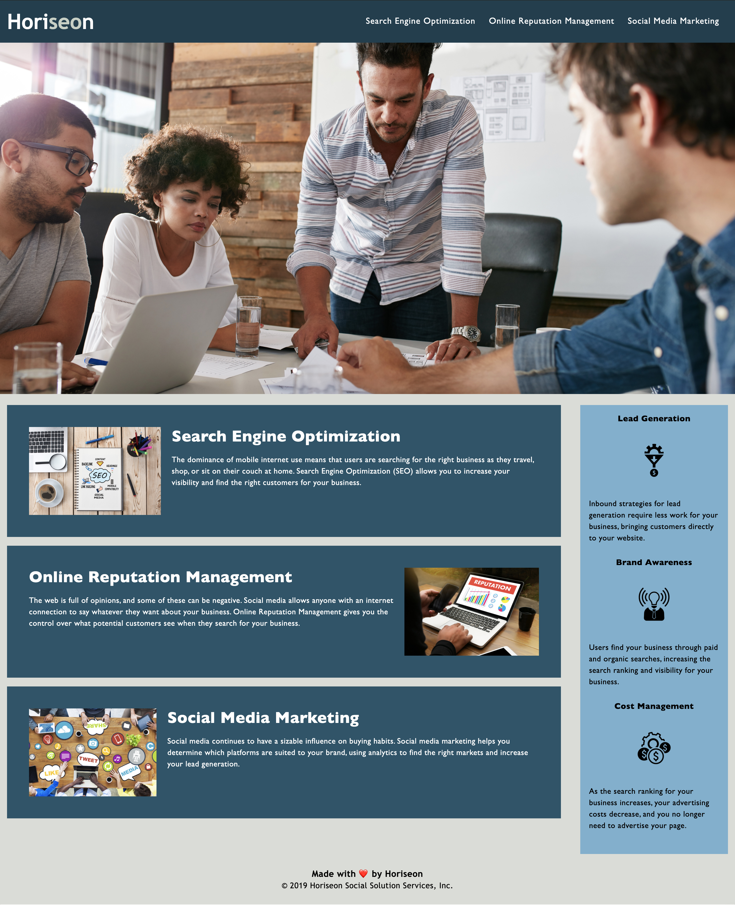

# Code Refactoring for Accessibility

## Description of Project

For this project we were tasked with taking the existing code of a marketing agencies, Horiseon, website and then refactoring it to ensure that it meets accessibility standards and is optimized for search engines. To start off this project I went through the code to make sure semantic HTML elements were present, that the HTML was structured in a logical way and that the CSS followed the same structure as the HTML. I continued by adding a descriptive title to the whole website and added appropriate alt attributes to images to better meet accessibility standards and optimize the website for search engines. Finally, I adjusted the colors, font size, line spacing and letter spacing within the CSS to ensure all of the content was optimized for visibility and readability.

## Screenshot of Webpage

## Link to Webpage

